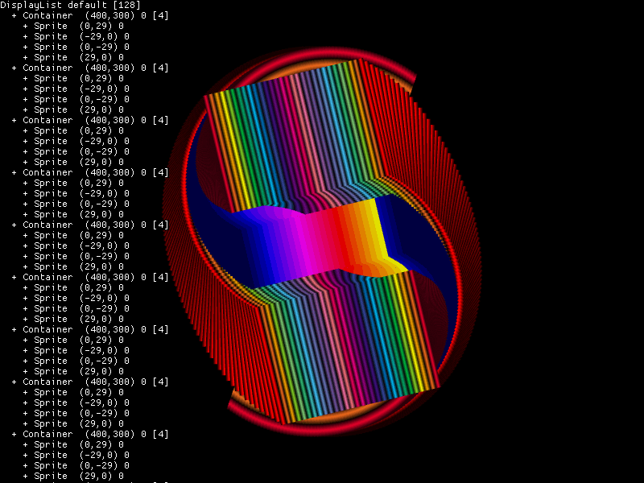

Phaser Display List Watcher Plugin
==================================

Shows the scene display lists.

Display
-------

    ± type name (x, y) depth (count) 

`+` is visible; `-` is invisible.

`x`, `y`, and `depth` are rounded to the nearest 0.1.

`count` is the number of children (Blitter, Container, Layer) or tiles (TilemapLayer).

Keyboard Controls
-----------------

| Key Combination                                                   | Action                |
|-------------------------------------------------------------------|-----------------------|
| <kbd>shift</kbd> + <kbd>left</kbd>, <kbd>right</kbd>, <kbd>up</kbd>, <kbd>down</kbd> | Scroll the display |
| <kbd>shift</kbd> + <kbd>pageup</kbd>                              | Scroll page up        |
| <kbd>shift</kbd> + <kbd>pagedown</kbd>                            | Scroll page down      |
| <kbd>shift</kbd> + <kbd>home</kbd>                                | Scroll to start       |
| <kbd>shift</kbd> + <kbd>end</kbd>                                 | Scroll to end         |
| <kbd>shift</kbd> + <kbd>Z</kbd>                                   | Toggle display on/off |
| <kbd>shift</kbd> + <kbd>X</kbd>                                   | Show display          |
| <kbd>shift</kbd> + <kbd>C</kbd>                                   | Hide display          |
| <kbd>shift</kbd> + <kbd>V</kbd>                                   | Reset scroll          |

Multiple Scenes
---------------

Scene displays are stacked left to right. Use the keyboard controls to scroll.

If you have stopped scenes that you never need to use again, you could remove them to make space.

Install
-------

### Quick Load

- [Quick load example](https://phaser.io/sandbox/W8VM9ZYG)

```js
// In preload():
this.load.scenePlugin('DisplayListWatcher', 'https://cdn.jsdelivr.net/npm/phaser-plugin-display-list-watcher@1.2.1')
```

### Module

```js
import DisplayListWatcher from 'phaser-plugin-display-list-watcher'

new Phaser.Game({
  plugins: {
    scene: [
      {
        key: 'DisplayListWatcher',
        plugin: DisplayListWatcher
      }
    ]
  }
})
```

### Script tags / UMD

- [Script tag example](https://codepen.io/samme/pen/EaYmBwp)

```html
<!-- after phaser.js -->
<script src="https://cdn.jsdelivr.net/npm/phaser-plugin-display-list-watcher@1.2.1"></script>
```

```js
/* global DisplayListWatcher */

new Phaser.Game({
  plugins: {
    scene: [
      {
        key: 'DisplayListWatcher',
        plugin: DisplayListWatcher
      }
    ]
  }
})
```
